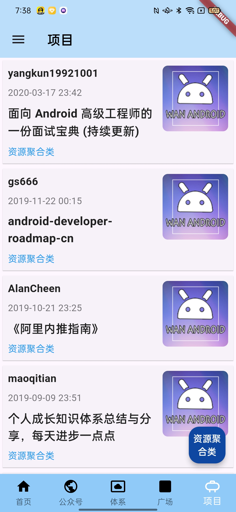
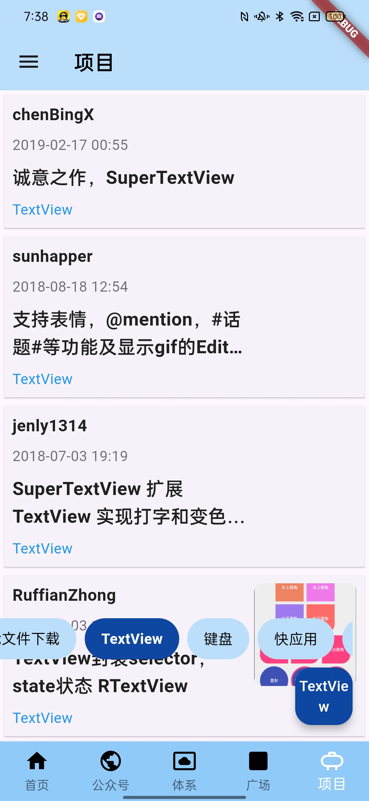
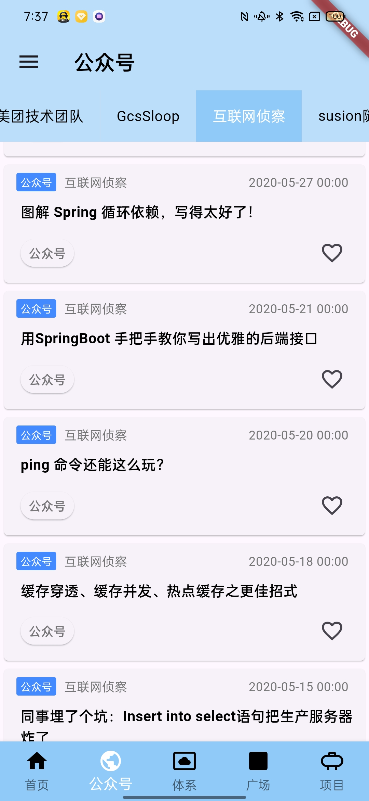
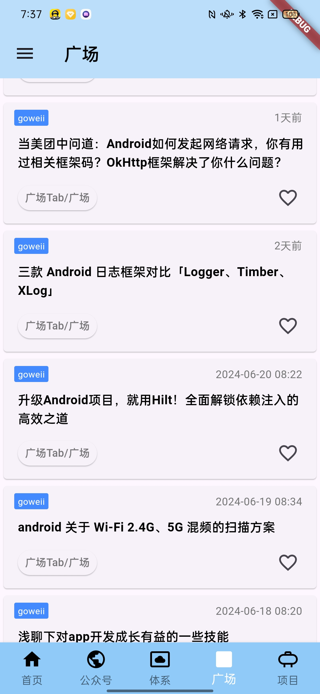
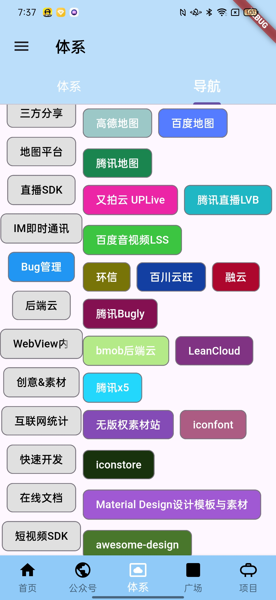
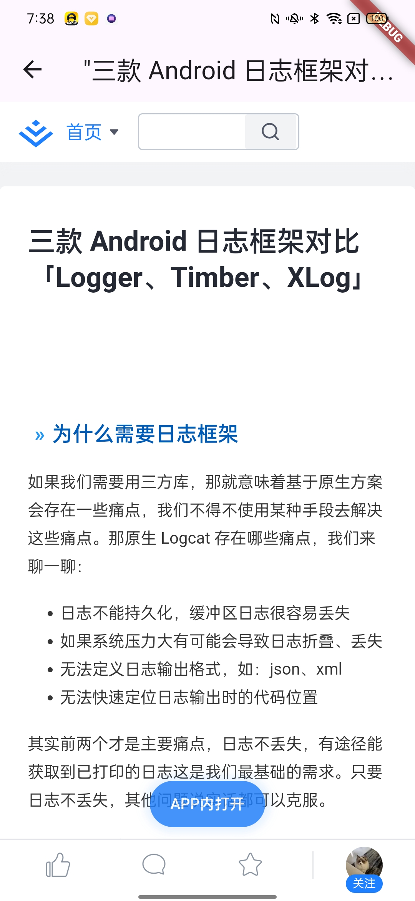
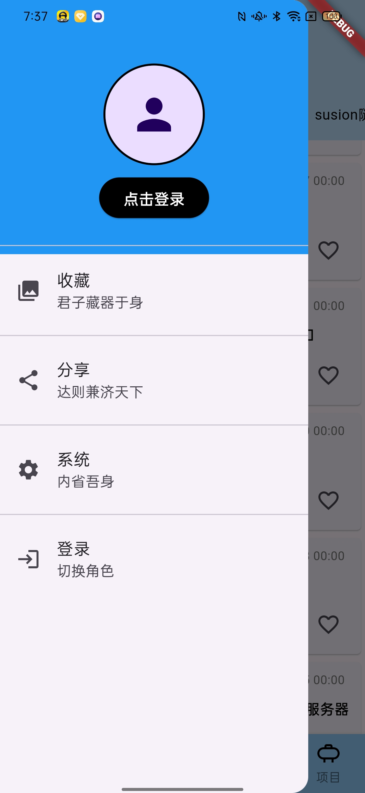

Flutter 面试通常涉及以下几个主要知识点：

1. **Flutter 基础知识**：
    - Flutter 是什么？它是一个开源的跨平台移动应用开发框架，由谷歌推出，使用 Dart 语言进行开发。
    - Flutter 的特点：热重载、丰富的组件库、高性能等。

2. **Dart 语言**：
    - Dart 语言的基本语法：变量、函数、类、继承、接口等。
    - 异步编程：Future、async、await 等关键字的使用。

3. **Widget**：
    - Flutter 应用程序的 UI 是通过组合 Widget 构建而成的。
    - Widget 分为 StatelessWidget 和 StatefulWidget 两种。
    - 常见的布局 Widget，如 Container、Column、Row、Stack 等。
    - 常见的功能性 Widget，如 Text、Image、ListView、GridView 等。

4. **State Management（状态管理）**：
    - 状态管理在 Flutter 中非常重要，常用的方案包括 setState、Provider、Bloc、GetX 等。
    - 状态管理的选择取决于应用的规模和复杂性。

5. **网络请求**：
    - 在 Flutter 中进行网络请求的常用库：如 Dio、http 等。
    - 异步处理和数据解析。

6. **路由管理**：
    - 如何进行页面之间的导航管理，包括命名路由和参数传递。

7. **Flutter 生态系统**：
    - 熟悉常用的第三方库和组件，如 Flutter 社区提供的开源库、插件等。
    - 对 Flutter 的生态有一定的了解和实际使用经验。

8. **性能优化**：
    - 理解 Flutter 应用的性能优化策略，如减少 Widget 的重建、避免不必要的重绘等。

9. **测试**：
    - 单元测试和集成测试在 Flutter 中的实施方法和工具。

10. **版本管理和发布**：
    - Flutter 应用程序的版本管理和发布流程。

#### 开发日记

1. **Note 页面绘制效率**
   主页切换tab 为了防止重复的刷新布局 我们使用 BottomNavigationBarProvider
   ```
   class BottomNavigationBarProvider extends ChangeNotifier {

    int _selectedIndex = 0;

    int get selectedIndex => _selectedIndex;

    void updateIndex(int index) {
    if (index != _selectedIndex) {
    _selectedIndex = index;
     notifyListeners();
      }
     }
   }
    ```

- 底部导航栏状态管理：

  使用 BottomNavigationBarProvider 类来管理底部导航栏的状态，包括当前选中的索引和 PageController 实例。
  在 HomePage 中通过 ChangeNotifierProvider 提供 BottomNavigationBarProvider 实例，并在需要监听状态变化的地方使用
  Consumer 包裹。

- 页面切换的优化：

  在 PageView 的 onPageChanged 回调中更新 BottomNavigationBarProvider的状态，确保页面切换时底部导航栏和顶部标题栏同步更新。
  在底部导航栏的 onTap 回调中调用 Provider 更新状态，并使用 PageController 控制页面切换，确保用户切换页面时的体验流畅。
  关于页面重建的问题，涉及到的主要是 PageView 组件。在 Flutter 中，PageView
  的子页面在切换时是会重新加载的，这是其设计上的特性。因此，无论是否使用了状态管理，页面切换都会导致当前页面的
  build 方法被调用。

  在您的代码中，使用 Consumer<BottomNavigationBarProvider>
  只是在状态变化时更新了底部导航栏和顶部标题栏的显示内容，而不会导致整个页面重新构建。但是，PageView
  子页面在切换时仍然会重新加载，这与底部导航栏的状态管理并没有直接关系。

  如果您希望避免页面重新加载带来的性能损耗，可以考虑使用 AutomaticKeepAliveClientMixin 或
  IndexedStack 来保持页面的状态，而不是每次切换都重新加载内容。这样可以确保在用户切换页面时保持页面的状态，提升用户体验。

综上所述，底部导航栏的状态管理并不会直接影响页面切换时 PageView 子页面的重新加载，这是 PageView 的默认行为。

- 流程是这样

  ```
  page 中  consumer <Provider> 监听 Provider的变化 当Provider notifychange时 监听变化 consumer 将会收到通知
  page 中 consumer 将会更新 
  开发  中 consumer 包裹的单元越小 绘制的效率越高 也就是说这是提高页面绘制的一种手段
  ```

2. **页面绘制 ☞ 页面状态管理 （with AutomaticKeepAliveClientMixin）**

**AutomaticKeepAliveClientMixin** 是 Flutter 中的一个 Mixin 类，用于在组件重建时保持组件的状态。在
Flutter 中，当组件树重建时，如果不是 StatefulWidget（是StatefulWidget但是在ViewPage中） 或者它们的 State
对象没有继承 AutomaticKeepAlive ，那么组件的状态会丢失。

为了解决这个问题，可以使用 AutomaticKeepAliveClientMixin。它提供了一种机制，允许组件通知 Flutter
框架即使在重建时也应该保持它们的状态。具体使用方法如下：

使用 Mixin: 要使用 AutomaticKeepAliveClientMixin，需要将你的 StatefulWidget 的 State 类与它混合（with）使用。

```
class MyWidget extends StatefulWidget {
  @override
  _MyWidgetState createState() => _MyWidgetState();
}

class _MyWidgetState extends State<MyWidget> with AutomaticKeepAliveClientMixin {
  @override
  bool get wantKeepAlive => true; // 返回 true 来告诉 Flutter 保持状态不被重置

  @override
  Widget build(BuildContext context) {
    super.build(context); // 确保调用 super.build(context) 来连接 Mixin
    return Container(
      // 这里是你的组件 UI
    );
  }
}

```

这个 Mixin 特别适用于那些需要在重建时保持其内部状态（比如列表中的滚动位置）的部分
UI，但是这些部分是封装在无状态组件中或者无法自行管理状态保持的情况。它有助于提高性能和用户体验，避免不必要地重置组件状态。

3.**布局**

SliverToBoxAdapter 和 SliverList 都是 Flutter 中用于构建可滚动视图的

- slivers。
  slivers 是 CustomScrollView 的一部分，它们定义了滚动视图中的各个部分。
- SliverToBoxAdapter
  SliverToBoxAdapter 的作用是将一个普通的 widget 包装成 sliver，使其可以被包含在 CustomScrollView
  中。它通常用于将单个非滚动 widget（如 banner、标题、图片等）插入到滚动视图中。

- SliverList
  SliverList 的作用是创建一个滚动的列表。它类似于 ListView，但可以和其他 sliver 一起使用以创建复杂的滚动效果
  。SliverList 通过 SliverChildBuilderDelegate 或
  SliverChildListDelegate 来定义其子项。通常用于显示大规模的、动态的子项列表。
  如HomeItemPage中使用了这布局

```
     child: CustomScrollView(
          controller: _scrollController, // 将滚动控制器分配给CustomScrollView
          slivers: <Widget>[
            const SliverToBoxAdapter(
              child: BannerWidget(),
            ),
            SliverList(
              delegate: SliverChildBuilderDelegate(
                (BuildContext context, int index) {
                  if (index < widget.items.length) {
                    return ArticleCard(widget.items[index]);
                  } else {
                    if (widget.reachedEnd) {
                      return const Padding(
                        padding: EdgeInsets.symmetric(vertical: 32.0),
                        child: Center(child: Text('已加载完所有数据')),
                      );
                    } else {
                      return const Padding(
                        padding: EdgeInsets.symmetric(vertical: 5.0),
                        child: Center(
                            child: CircularProgressIndicator(
                          strokeWidth: 2,
                          color: Color(0xFF8C9EFF),
                        )),
                      );
                    }
                  }
                },
                // 计算列表项数量，包括加载指示器或已加载完所有数据的文本
                childCount: widget.items.length + 1,
              ),
            ),
          ],
        ),

```

4. **一些属性**
   Flutter 中常见的组件有很多，我来逐个列举一些常用组件及其属性，并举例说明它们的作用：

- Chip

属性示例：
label: 显示在芯片中的文本
avatar: 芯片左侧显示的小组件（如头像）
backgroundColor: 背景颜色
作用： Chip 组件用于显示标签或者小块信息，通常用于标记或过滤。

```
Chip(
  label: Text('Label'),
  avatar: CircleAvatar(
    backgroundColor: Colors.grey.shade800,
    child: Text('A'),
  ),
  backgroundColor: Colors.blue.shade200,
)
```

- Wrap

属性示例：
alignment: 子组件的对齐方式
spacing: 子组件之间的间距
作用： Wrap 组件用于按行或按列排列子组件，自动换行或溢出处理。

```
Wrap(
  alignment: WrapAlignment.center,
  spacing: 8.0,
  children: <Widget>[
    Chip(label: Text('One')),
    Chip(label: Text('Two')),
    Chip(label: Text('Three')),
  ],
)
```

- Row
  属性示例：
  mainAxisAlignment: 主轴对齐方式（如 start, end, center）
  crossAxisAlignment: 交叉轴对齐方式（如 start, end, center）
  作用： Row 组件将子组件水平排列，可以控制子组件在主轴和交叉轴上的对齐方式。

```
Row(
  mainAxisAlignment: MainAxisAlignment.spaceEvenly,
  crossAxisAlignment: CrossAxisAlignment.center,
  children: <Widget>[
    Icon(Icons.star),
    Text('Row Example'),
    IconButton(icon: Icon(Icons.more_vert), onPressed: () {}),
  ],
)
```

- Column

属性示例：
mainAxisAlignment: 主轴对齐方式（如 start, end, center）
crossAxisAlignment: 交叉轴对齐方式（如 start, end, center）
作用： Column 组件将子组件垂直排列，可以控制子组件在主轴和交叉轴上的对齐方式。

```
Column(
  mainAxisAlignment: MainAxisAlignment.center,
  crossAxisAlignment: CrossAxisAlignment.start,
  children: <Widget>[
    Text('Column Example'),
    Icon(Icons.star),
    IconButton(icon: Icon(Icons.more_vert), onPressed: () {}),
  ],
)
```

- Padding

属性示例：
padding: 四周的内边距
作用： Padding 组件用于给子组件添加内边距。

```

Padding(
  padding: EdgeInsets.all(16.0),
  child: Text('Padded Text'),
)

```

- Container
  属性示例：
  color: 背景颜色
  width: 宽度
  height: 高度
  作用： Container 组件可以包含和装饰其他组件，并提供对其进行布局、绘制和定位的功能。

```

Container(
  color: Colors.blue,
  width: 100.0,
  height: 100.0,
  child: Center(child: Text('Container')),
)
```

- IconButton

属性示例：
icon: 图标
onPressed: 点击事件处理函数
作用： IconButton 组件显示一个可点击的图标按钮。

```

IconButton(
  icon: Icon(Icons.add),
  onPressed: () {
    // 处理点击事件
  },
)
```

PageView

属性示例：
children: 页面列表
onPageChanged: 页面切换回调函数
作用： PageView 组件用于显示多个页面，支持水平滑动切换。

```
PageView(
  children: <Widget>[
    Container(color: Colors.red),
    Container(color: Colors.green),
    Container(color: Colors.blue),
  ],
  onPageChanged: (int index) {
    print('Page changed to index $index');
  },
)
```

- BottomNavigationBarItem

属性示例：
icon: 图标
label: 文本标签
作用： BottomNavigationBarItem 组件用于底部导航栏的每个条目。

```
BottomNavigationBarItem(
  icon: Icon(Icons.home),
  label: 'Home',
)
```

- ListView

属性示例：
children: 列表项列表
itemBuilder: 列表项构建器
作用： ListView 组件用于显示可滚动的列表。

```
ListView(
  children: <Widget>[
    ListTile(title: Text('Item 1')),
    ListTile(title: Text('Item 2')),
    ListTile(title: Text('Item 3')),
  ],
)
```

- Expanded

属性示例：
flex: 扩展比例
作用： Expanded 组件用于在 Row 或 Column 中扩展以填充剩余空间。

```
Row(
  children: <Widget>[
    Expanded(
      flex: 1,
      child: Container(color: Colors.red),
    ),
    Expanded(
      flex: 2,
      child: Container(color: Colors.blue),
    ),
  ],
)
```

以上是这些组件或模式常见的属性及其在Flutter中的用法示例。它们分别用于创建页面视图、显示横幅信息和在数据变化时更新UI。
这些是一些常见的 Flutter 组件及其属性示例。Flutter 还有很多其他强大和灵活的组件，可以根据具体需要进一步探索和使用。以上组件在本项目中均有使用
还有一些像是PageView、NetScrollView、GridView etc...还请看源码学习

`didUpdateWidget` 方法在 Flutter 的 `StatefulWidget`
中被调用时，表示当父部件重新构建并提供了新的自身实例时。这通常发生在父部件重新构建时，其所有子部件（包括有状态部件）可能会被重新构建。以下是其作用的详细解释及其在
Flutter 组件生命周期中的作用：

* * *

#### `didUpdateWidget` 的作用

1. **部件重新构建：**
    - 当父部件重新构建时，其所有子部件都可能会被重新构建，包括有状态部件。

2. **接收新属性：**
   -
   每当框架认为需要使用新的自身实例更新部件（例如接收到来自父部件的新属性）时，将调用 `didUpdateWidget`
   方法。

3. **更新状态：**
    - 该方法提供了一个机会，可以通过比较旧部件实例（`oldWidget`）和新部件实例（`widget`
      ，作为方法参数提供）来响应属性变化。此比较有助于确定是否需要根据属性变化更新部件内部的状态。

4. **示例用途：**
    - **同步状态：**
      如果您的有状态部件维护了应反映属性变化的内部状态（例如您的情况中的 `currentPageIndex`
      ），则可以在 `didUpdateWidget` 中更新状态（例如更新 `_selectedIndex`
      ），以反映新属性值（`widget.currentPageIndex`）。

    - **重置状态：** 您还可以使用 `didUpdateWidget` 在需要进行重置的情况下重置特定的状态变量或执行清理操作。

#### `didUpdateWidget` 的工作原理

- **方法签名：**
  ```dart
  void didUpdateWidget(covariant StatefulWidget oldWidget) {
    // 通过比较 oldWidget 和 widget 来决定需要的更新操作
    super.didUpdateWidget(oldWidget);
    // 在此处编写您的自定义逻辑
  }
  ```

- **比较操作：**
    - 在 `didUpdateWidget` 中，通常会比较 `oldWidget` 和 `widget`
      的属性，以决定是否以及如何更新局部状态或执行其他操作。此比较有助于避免不必要的更新，并确保部件的状态能够准确地反映最新的属性。

- **状态管理：**
    - 在 `didUpdateWidget` 中使用 `setState` 时要谨慎，因为它可能会导致级联重建。只有在维护部件一致性或响应属性变化时才更新状态。

#### 示例场景

对于您的 `FloatingMenu` 部件：

- **目的：** 确保 `_selectedIndex` 反映由父部件（例如 `ProjectPageItem`
  或其他父部件）提供的 `currentPageIndex` 的变化。

- **实现方式：** 您可以使用 `didUpdateWidget` 方法在 `widget.currentPageIndex`
  改变时更新 `_selectedIndex`。这样确保菜单基于最新的属性值显示正确的选定项。

```dart
void didUpdateWidget(covariant FloatingMenu oldWidget) {
  super.didUpdateWidget(oldWidget);
  // 当 currentPageIndex 变化时更新本地的 _selectedIndex
  if (widget.currentPageIndex != _selectedIndex) {
    setState(() {
      _selectedIndex = widget.currentPageIndex;
    });
  }
}
```

#### 结论

`didUpdateWidget` 对于响应属性变化管理状态非常重要，确保您的有状态部件能够与部件树中的变化保持同步。正确使用此方法有助于在
Flutter 应用程序中维护响应性和一致性的用户界面。

#### End...








